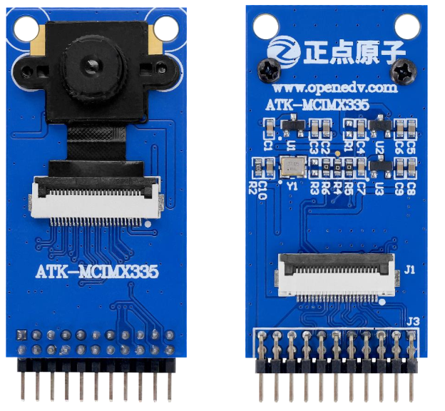
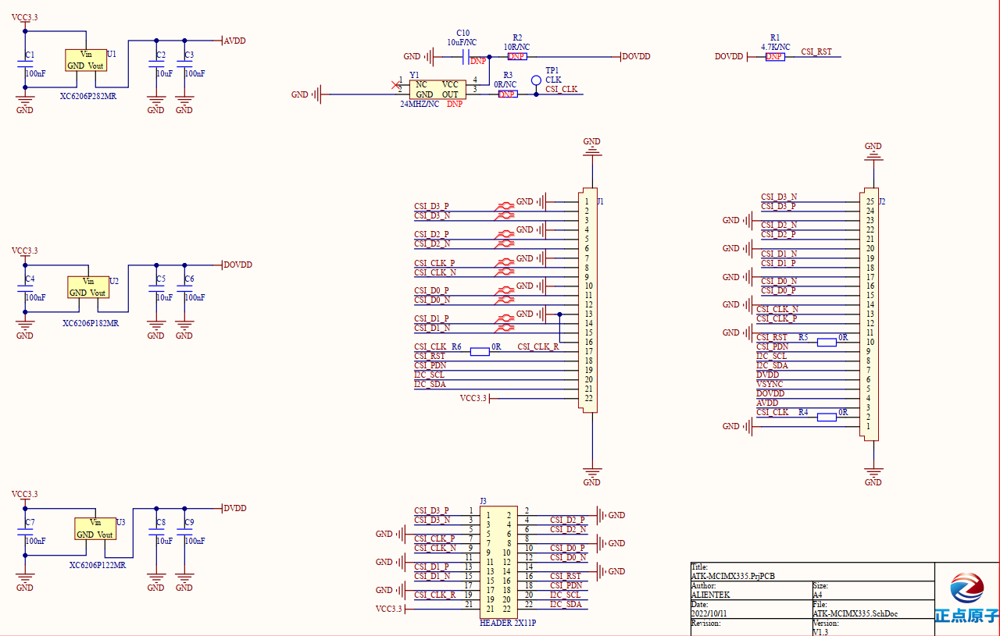

## 1 Introduction

### 1.1 Appearence

The ATK-MCIMX335 module looks like this:

### 1.2 Features

ATK-MCIMX335-v1.3 (V1.3 is the version number, and the product is denoted by ATK-MCIMX335 below) is ALIENTEK launched a high-performance 500W pixel HD camera module. The module is produced by SONY Corporation a 1/2.8 inch CMOS 2592 * 1944 image sensor: IMX335. At the same time, the ATK-MCIMX335 module is integrated active crystal and LDO chips. The module interface adopts 2 * 11pin row needle with a spacing of 2mm and 22pin with a spacing of 0.5mm
FPC interface, which can be selected by users according to different use scenarios.

The ATK-MCIMX335 module has the following characteristics:
- CMOS active pixel dot.
- Built-in timing adjustment circuit, H/V driver and serial communication circuit.
- Input frequency: 6 to 27 MHz / 37.125 MHz / 74.25 MHz.
- Recommended number of recording pixels: about 2592 (H) × 1944 (V). 5.04 million pixels.
- Readout mode:
  Full pixel scan mode
  Horizontal/vertical 2/2 line combination mode
  Window clipping mode
  Vertical/horizontal direction - normal/inverted readout mode
- Readout rate: 2592 (H)× 1944 (V) A/D 10 bits maximum frame rate of 60 frames /s in full pixel scan mode
- High Dynamic Range (HDR) function: multi-exposure HDR, digital overlapping HDR
- Variable speed shutter function (resolution 1H unit)
- 10-bit / 12-bit A/D converter
- CDS/PGA function
0 dB to 30 dB: simulated gain 30 dB (step size 0.3 dB)
30.3 dB to 72 dB: analog gain 30 dB + digital gain 0.3 to 42 dB (step size 0.3 dB)
- Support I/O: CSI-2 serial data output (2 Lane / 4 Lane, RAW10 / RAW12 output)

### 1.3 Parameter

The basic features are described as follows.

| Product model number | ATK-MCIMX335 | Dimensions of form | 25mm*47.5mm |
| -------------------- | ------------ | ------------------ | ----------- |

The CMOS characteristics are described as follows.

| CMOS/ photosensitive model | SONY IMX335                                                  |
| -------------------------- | ------------------------------------------------------------ |
| Single pixel size          | 2.0μm(H)×2.0μm(V)                                            |
| Frequency of input         | 6 to 27MHz / 37.125MHz / 74.25MHz                            |
| Suggested resolution       | 2592(H)×1944(V), 5.04M pixels                                |
| Rate of readout            | The maximum frame rate in full pixel scanning mode is 2592 (H) ×1944 (V) A/D 10 bits: 60 frames/SEC |
| I/O support                | CSI-2 serial data output (2 channels /4 channels, RAW10/RAW12 output) |

The interface features are described as follows.

| Connection method            | Pin or FPC interface | Interface type     | MIPI CSI, 4 channels |
| ---------------------------- | -------------------- | ------------------ | -------------------- |
| Number of pins in needle row | 2*11 pin             | Number of FPC pins | 22 pin               |
| Spacing of needles           | 2.0 mm               | FPC pin spacing    | 0.5 mm               |

The lens parameters are as follows.

| Type of lens      | 1 / 2.8 INCH | Light sensing chip                | IMX335      |
| ----------------- | ------------ | --------------------------------- | ----------- |
| Focal length      | 4.4MM        | Pixel                             | 2704 * 2104 |
| Aperture of light | 2.0          | Digital circuit voltage           | 1.1-1.3V    |
| Angle of view     | 70°          | Interface circuit Voltage (DOVDD) | 1.7-1.9V    |
| Distortion        | <1%          | Interface Circuit Voltage (AVDD)  | 2.8-3.0V    |

The electrical characteristics are described as follows.

| Voltage of module | 3.3V                           | I/O voltage | 1.8V |
| ----------------- | ------------------------------ | ----------- | ---- |
| Power consumption | 3.3V 160mA(2592 * 1944 pixels) |             |      |

The temperature parameters are as follows.

| Operating temperature | 0℃~+50℃ | Storage temperature | -30℃~+80℃ |
| --------------------- | ------- | ------------------- | --------- |

### 1.4 Interface

| J3- Row pin connection slogan | J1-FPC connection number | Name of pin                                         | Note                                                |
| ------ | ----- | ----------------------------------------------------------- | ------ |
| 1      | 2                        | CSI_D3_P    | MIPI CSI sends channel 3 differential positive signals      |
| 2                             | 1                        | GND         | Ground to earth                                             |
| 3                             | 3                        | CSI_D3_N    | MIPI CSI sends channel 3 differential negative signal       |
| 4                             | 5                        | CSI_D2_P    | MIPI CSI sends channel 2 differential positive signals      |
| 5                             | 4                        | GND         | Ground to earth                                             |
| 6                             | 6                        | CSI_D2_N    | MIPI CSI sends channel 2 differential negative signal       |
| 7                             | 8                        | CSI_CLK_P   | The MIPI CSI outputs a clock differential positive signal   |
| 8                             | 7                        | GND         | Ground to earth                                             |
| 9                             | 9                        | CSI_CLK_N   | The MIPI CSI outputs a clock differential difference signal |
| 10                            | 11                       | CSI_D0_P    | MIPI CSI sends channel 0 differential positive signals      |
| 11                            | 10                       | GND         | Ground to earth                                             |
| 12                            | 12                       | CSI_D0_N    | MIPI CSI sends channel 0 differential negative signals      |
| 13                            | 14                       | CSI_D1_P    | MIPI CSI sends channel 1 differential positive signals      |
| 14                            | 13                       | GND         | Ground to earth                                             |
| 15                            | 15                       | CSI_D1_N    | MIPI CSI sends channel 1 differential negative signals      |
| 16                            | 18                       | CSI_RST     | Reset signal        |
| 17                            | 16                       | GND         | Ground to earth |
| 18                            | 19                       | CSI_PDN     | Control signal to enable module power supply |
| 19                            | 17                       | CSI_CLK_R   | Clock signal |
| 20                            | 20                       | I2C_SCL     | I2C clock signal |
| 21                            | 22                       | VCC3.3      | Input power supply |
| 22                            | 21                       | I2C_SDA     | I2C data/address transfer signal |

## 2 Schematic

The schematic diagram of the ATK-MCIMX335 module is shown as follows.

